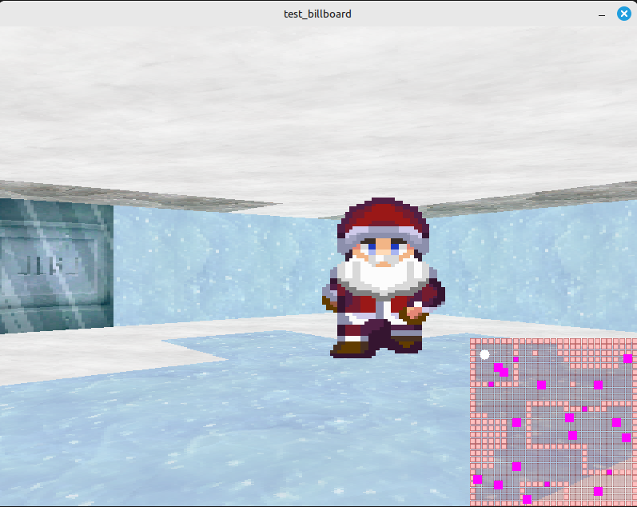
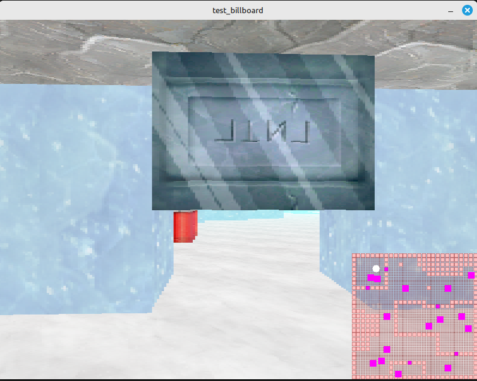
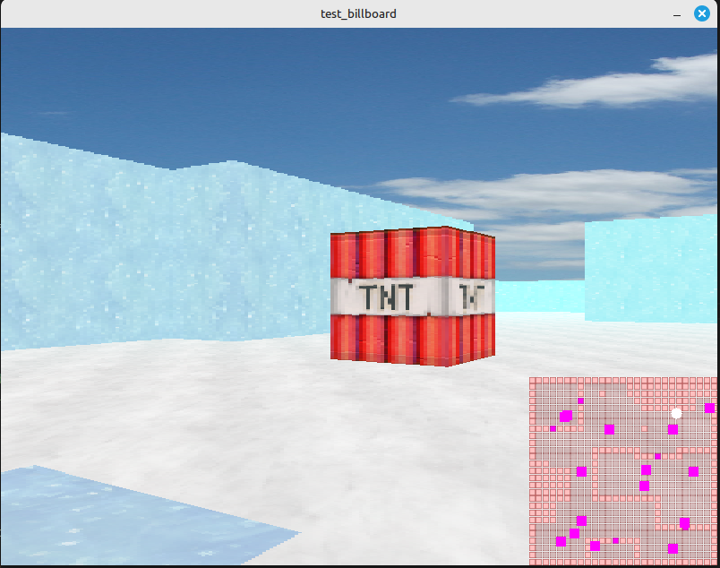

# libmod_ray - Motor de Raycasting para BennuGD2

Módulo de raycasting 3D para BennuGD2 con soporte para múltiples niveles, sprites billboard, fog y minimapa.

## 📸 Capturas de Pantalla







## Características

- **Renderizado 3D**: Motor de raycasting optimizado
- **Múltiples Niveles**: Soporte para suelo, techo y niveles intermedios
- **Puertas Animadas**: Sistema completo de puertas con animaciones
- **Sistema Billboard**: Sprites que siempre miran a la cámara con múltiples direcciones
- **Fog (Niebla)**: Sistema de fog configurable con color y distancias
- **Minimapa**: Minimapa en tiempo real con posición de cámara y sprites
- **Colisiones**: Sistema de colisiones con paredes

## API Completa

### Inicialización

```prg
RAY_INIT(display_width, display_height, fov, strip_width)
```
Inicializa el motor de raycasting.

### Carga de Mapas

```prg
RAY_LOAD_MAP(filename, fpg_textures)
```
Carga un mapa `.raymap` con las texturas del FPG especificado.

### Cámara

```prg
RAY_SET_CAMERA(x, y, z, rot)
```
Establece la posición y rotación de la cámara.

```prg
RAY_MOVE_CAMERA(forward, strafe)
```
Mueve la cámara relativa a su dirección actual.

```prg
RAY_ROTATE_CAMERA(angle)
```
Rota la cámara horizontalmente.

```prg
RAY_LOOK_UP_DOWN(amount)
```
Ajusta el pitch (mirar arriba/abajo).

```prg
RAY_PITCH_UP(amount)
RAY_PITCH_DOWN(amount)
```
Controles de pitch individuales.

```prg
x = RAY_GET_CAMERA_X()
y = RAY_GET_CAMERA_Y()
```
Obtiene la posición actual de la cámara.

### Sistema Billboard

```prg
RAY_SET_BILLBOARD(enabled, num_directions)
```
Activa el sistema billboard. `num_directions` típicamente 4, 8 o 12.

```prg
RAY_UPDATE_SPRITE_POSITION(x, y, z)
```
Actualiza la posición de un sprite desde BennuGD (llamar desde el proceso del sprite).

### Colisiones

```prg
collision = RAY_CHECK_COLLISION(x, y, radius)
```
Verifica si hay colisión con paredes en la posición (x, y) con el radio dado.
Retorna 1 si hay colisión, 0 si no.

### Puertas

```prg
RAY_TOGGLE_DOOR(x, y)
```
Abre/cierra la puerta en la posición especificada.

### Fog (Niebla)

```prg
RAY_SET_FOG(enabled, r, g, b, start_distance, end_distance)
```
Configura el sistema de fog.
- `enabled`: 1 = activado, 0 = desactivado
- `r, g, b`: Color del fog (0-255)
- `start_distance`: Distancia donde empieza el fog
- `end_distance`: Distancia donde el fog es completo

**Ejemplo:**
```prg
RAY_SET_FOG(1, 255, 255, 255, 512.0, 2048.0);  // Niebla blanca
```

### Minimapa

```prg
RAY_SET_MINIMAP(enabled, size, x, y, scale)
```
Configura el minimapa.
- `enabled`: 1 = activado, 0 = desactivado
- `size`: Tamaño del minimapa en pixels (cuadrado)
- `x, y`: Posición en pantalla
- `scale`: Escala del minimapa (menor = más zoom out)

**Ejemplo:**
```prg
RAY_SET_MINIMAP(1, 250, 590, 390, 0.2);  // Minimapa 250x250 en esquina inferior derecha
```

**Colores del minimapa:**
- Blanco: Cámara/jugador
- Cyan: Sprites y puertas
- Rosa/Azul: Paredes

### Renderizado

```prg
RAY_RENDER()
```
Renderiza un frame completo del motor.

### Spawn Flags

```prg
x = RAY_GET_FLAG_X(flag_id)
y = RAY_GET_FLAG_Y(flag_id)
z = RAY_GET_FLAG_Z(flag_id)
```
Obtiene las coordenadas de un spawn flag del mapa.

```prg
RAY_BIND_TO_FLAG(flag_id)
```
Vincula el proceso actual a un spawn flag (para sprites).

## Ejemplo de Uso

Ver `test_billboard.prg` para un ejemplo completo de uso del motor con:
- Carga de mapa y texturas
- Sistema billboard con sprites animados
- Movimiento FPS con colisiones
- Puertas interactivas
- Fog y minimapa configurados
- Audio (música y sonidos)

```prg
import "libmod_ray";
import "libmod_gfx";
import "libmod_sound";

program raycasting_demo;

global
    fpg_textures;
    fpg_sprites;
end

process main()
begin
    set_mode(800, 600, 32);
    set_fps(60, 0);
    
    // Cargar recursos
    fpg_textures = load_fpg("Textures/textures.fpg");
    fpg_sprites = load_fpg("sprites.fpg");
    
    // Inicializar motor
    RAY_INIT(800, 600, 60, 4);
    RAY_LOAD_MAP("Maps/level1.raymap", fpg_textures);
    
    // Configurar fog y minimapa
    RAY_SET_FOG(1, 255, 255, 255, 512.0, 2048.0);
    RAY_SET_MINIMAP(1, 200, 590, 390, 0.2);
    
    // Activar billboard
    RAY_SET_BILLBOARD(1, 12);
    
    // Crear sprites
    enemy(1);
    enemy(2);
    
    // Loop principal
    loop
        // Controles
        if (key(_w)) RAY_MOVE_CAMERA(100, 0); end
        if (key(_s)) RAY_MOVE_CAMERA(-100, 0); end
        if (key(_a)) RAY_MOVE_CAMERA(0, -100); end
        if (key(_d)) RAY_MOVE_CAMERA(0, 100); end
        if (key(_left)) RAY_ROTATE_CAMERA(-50000); end
        if (key(_right)) RAY_ROTATE_CAMERA(50000); end
        if (key(_e)) RAY_TOGGLE_DOOR(RAY_GET_CAMERA_X(), RAY_GET_CAMERA_Y()); end
        
        // Renderizar
        RAY_RENDER();
        
        frame;
    end
end

process enemy(flag_id)
private
    float x, y, z;
    int move_timer;
end
begin
    // Vincular a spawn flag
    RAY_BIND_TO_FLAG(flag_id);
    x = RAY_GET_FLAG_X(flag_id);
    y = RAY_GET_FLAG_Y(flag_id);
    z = RAY_GET_FLAG_Z(flag_id);
    
    file = fpg_sprites;
    graph = 1;
    
    loop
        // Movimiento aleatorio
        if (move_timer == 0)
            float new_x = x + rand(-50, 50);
            float new_y = y + rand(-50, 50);
            
            if (!RAY_CHECK_COLLISION(new_x, new_y, 32))
                x = new_x;
                y = new_y;
                RAY_UPDATE_SPRITE_POSITION(x, y, z);
            end
            
            move_timer = 30;
        else
            move_timer--;
        end
        
        frame;
    end
end
```

## Notas Técnicas

- Las distancias están en unidades del mundo (128 unidades = 1 baldosa)
- El fog se aplica a paredes, suelo, techo y sprites
- El minimapa muestra todo el mapa estáticamente, con la cámara moviéndose
- Los colores en `gr_put_pixel` están limitados: blanco (0xFFFFFFFF) y cyan (0xFF00FFFF) funcionan correctamente

## Créditos

Este módulo está basado en [SDL2 Raycasting Engine](https://github.com/andrew-lim/sdl2-raycast) por **Andrew Lim**, adaptado y extendido para BennuGD2.

### Características añadidas sobre el original:
- Integración completa con BennuGD2
- Sistema de múltiples niveles (3 niveles independientes)
- Sistema de puertas animadas mejorado
- Sistema billboard con múltiples direcciones
- Fog configurable
- Minimapa en tiempo real
- Sistema de spawn flags
- Editor de mapas Qt incluido
- Formato de mapa `.raymap` personalizado

Agradecimientos especiales a Andrew Lim por el excelente motor de raycasting base.

## Editor de Mapas

El módulo incluye un editor de mapas Qt (`tools/raymap_editor/`) para crear y editar archivos `.raymap`.
